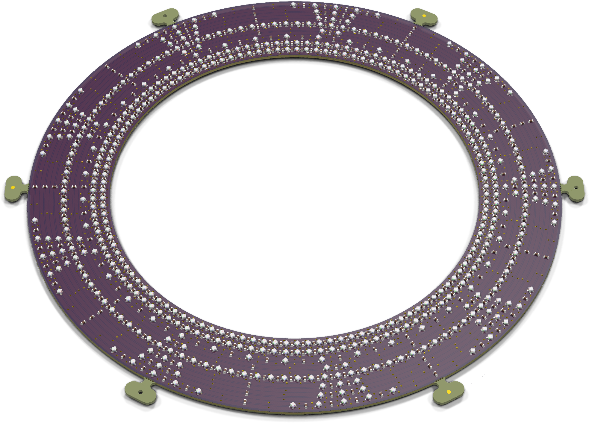
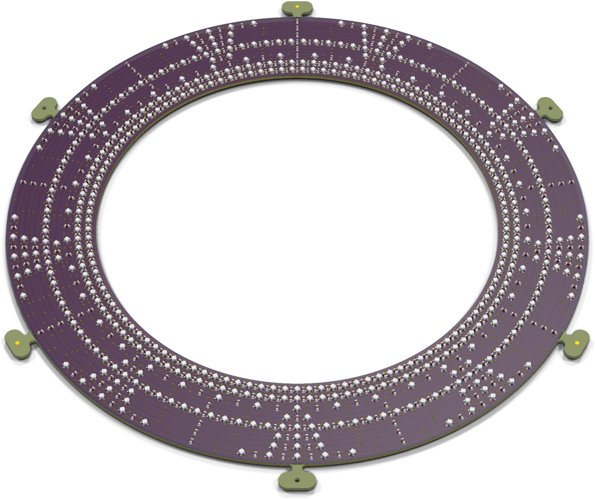
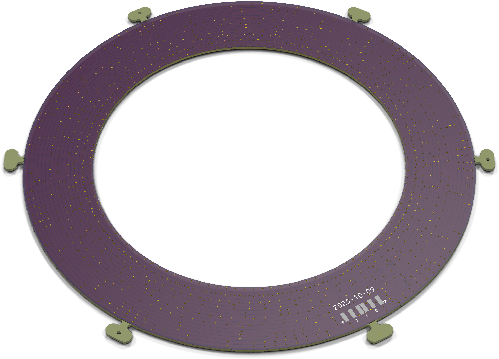

# Gate

## Trademark

This is an open source project, but bear in mind you cannot sell boards bearing the Andrews & Arnold Ltd name, the A&A logo, the registered trademark AJK logo, or the GS1 allocated EANs assigned to Andrews & Arnold Ltd.

## PCB Designs

These files are for use with [KiCAD](https://www.kicad.org).

- [Gate](Gate.kicad_pro)
## 3D

3D case designs are normally automatically created from the PCB so as to ensure correct details and placement of apertures, etc.

- [Stargate](Stargate.stl)
- [StargateBottom](StargateBottom.stl)
- [StargateRamp](StargateRamp.stl)
- [StargateRampBottom](StargateRampBottom.stl)
- [StargateRampTop](StargateRampTop.stl)
- [StargateTop](StargateTop.stl)

## Images

---

*Auto generated README.md 2025-10-01T14:56:03*
