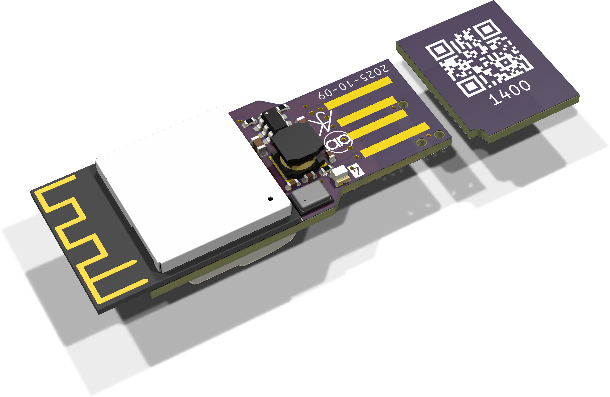
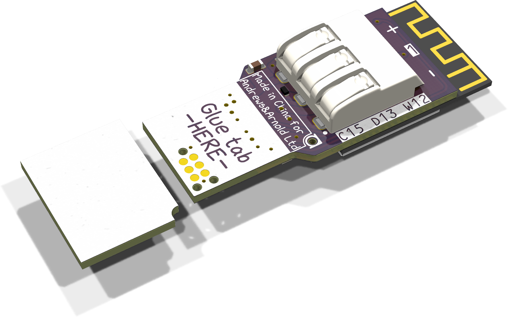

# USBA board

A small PCB design to plug in directly to an old school USB socket for power.
Serial via USB direct to ESP32-S3.

- Includes power supply and WS2812B RGB LED, and then output to drive a chain of such LEDs.
- Includes I2S microphone.
- Includes 3 pin WAGO connector for WS2812 LED or similar.

[Buy](https://www.amazon.co.uk/dp/B0DGD5XPLT) Note some older boards may be simpler RGB LED and env sensor I2C and no button pads.

## Programming

Can be directly programmed using esptool, i.e. `idf.py flash` via the USB headers, or using the 5 pin serial pads on the back of the board.

