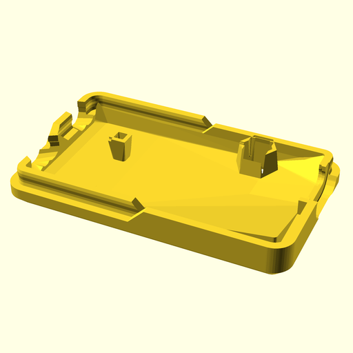
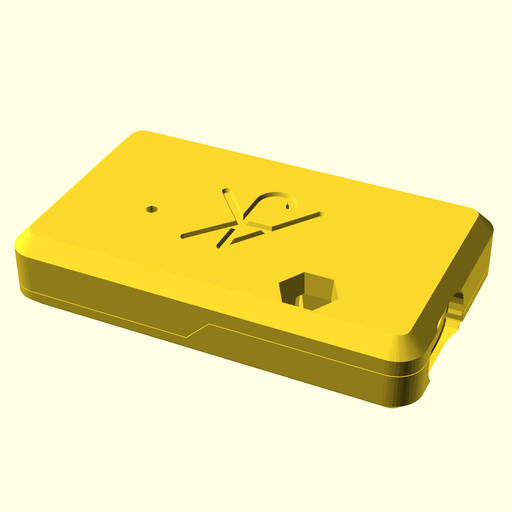
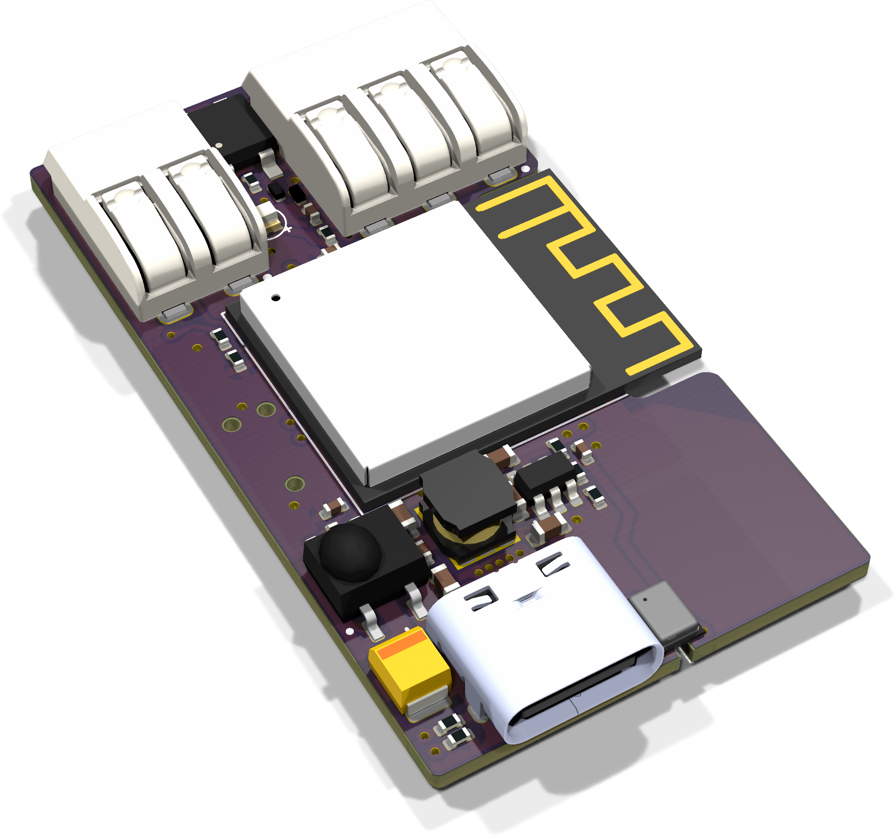
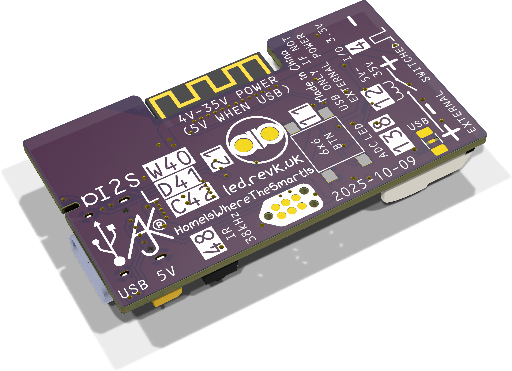
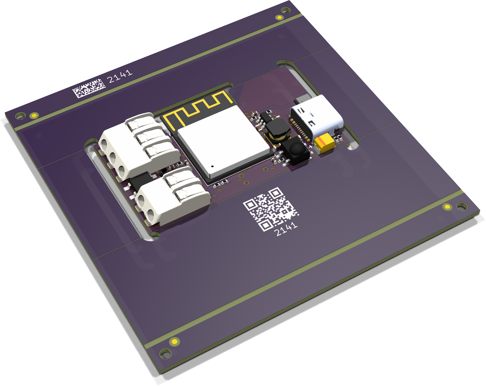

# LEDR

## Trademark

This is an open source project, but bear in mind you cannot sell boards or cases bearing the Andrews & Arnold Ltd name, the A&A logo, the registered trademark AJK logo, or the GS1 allocated EANs assigned to Andrews & Arnold Ltd.

## PCB Designs

These files are for use with [KiCAD](https://www.kicad.org).

- [LED](LED.kicad_pro)

## 3D

3D case designs are normally automatically created from the PCB so as to ensure correct details and placement of apertures, etc.

|Design|Bottom|Top|Combined|
|------|------|---|--------|
|LED||||

## PCB Images

---

*Auto generated README.md 2025-11-09T11:03:16*
