# PCBs

Various PCBs designed for use with LED code.

## Trademark

This is an open source project, but bear in mind you cannot sell boards bearing the Andrews & Arnold Ltd name, the A&A logo, the registered trademark AJK logo, or the GS1 allocated EANs assigned to Andrews & Arnold Ltd.

## LEDA

USB-A board

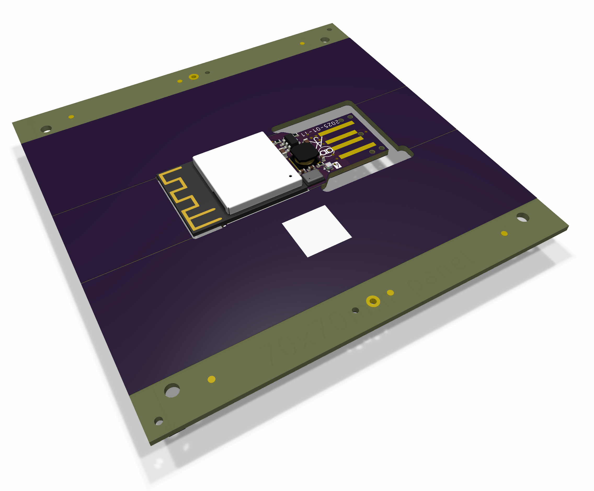
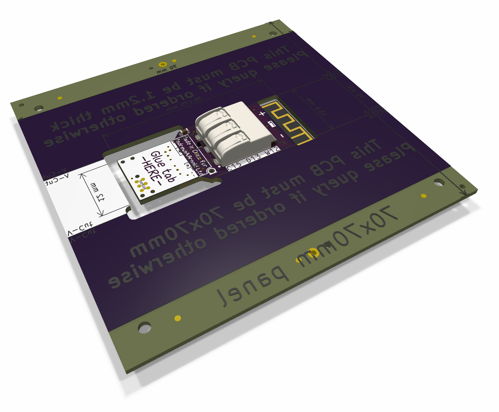

## LEDC

USB-C board

## LEDX

Non USB board

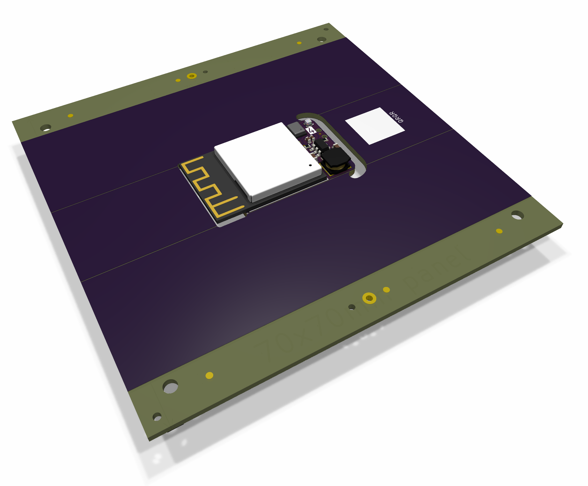
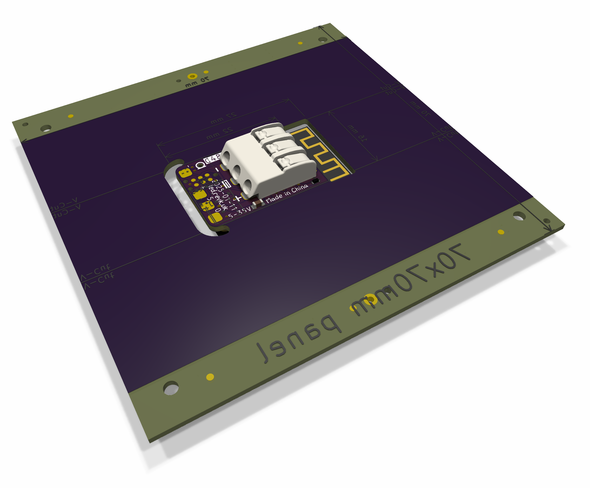

## LEDR

USB-C uber board

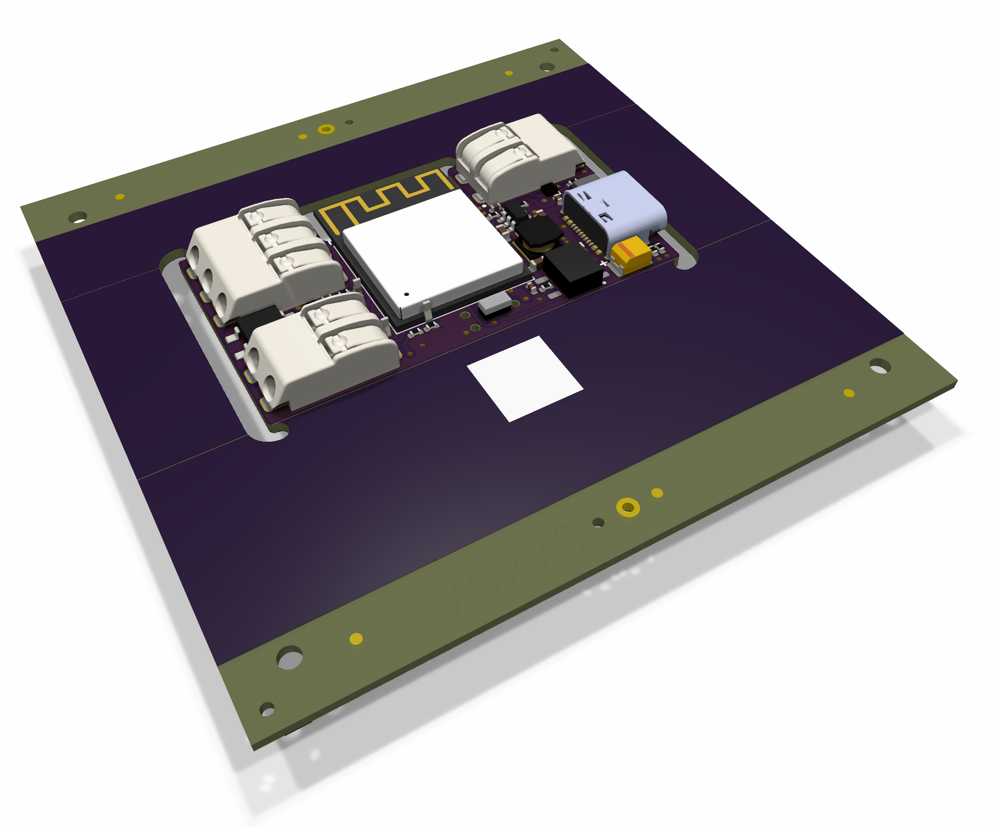
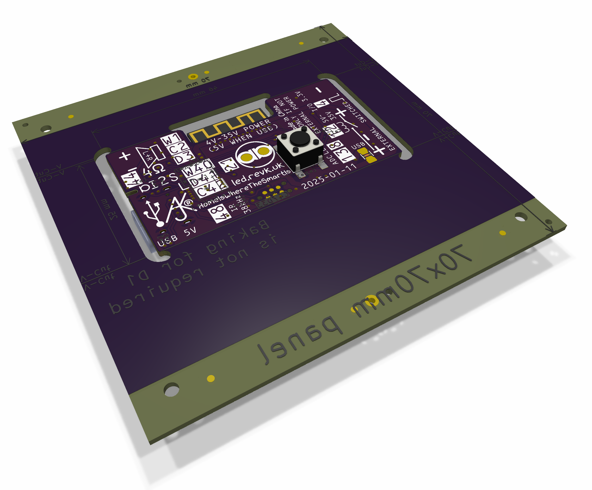

## LEDx2

USB-C dual LED board

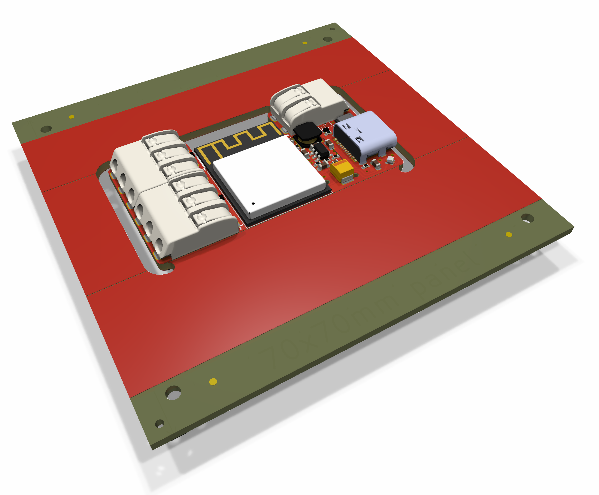
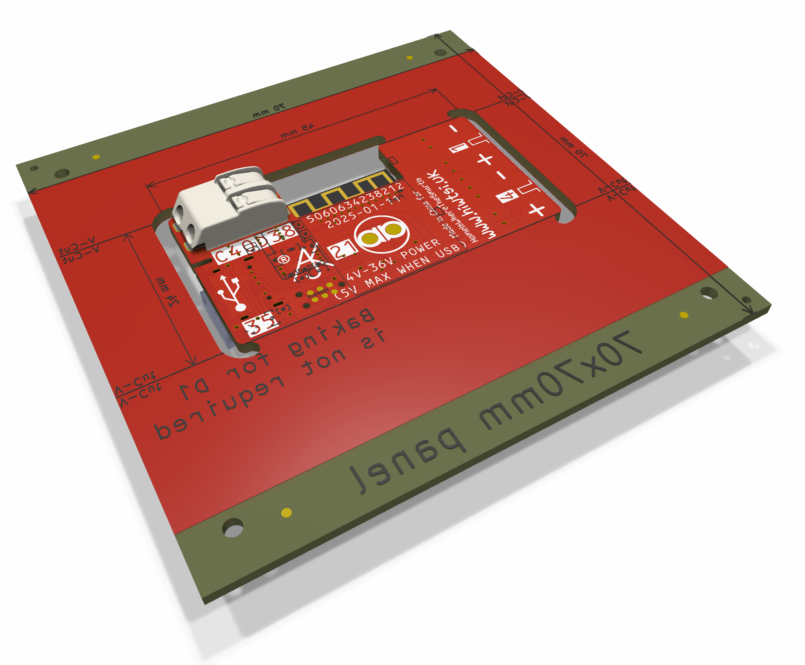

## Coaster

Coaster board

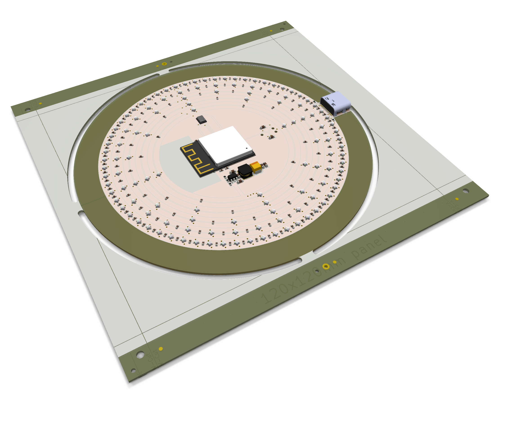
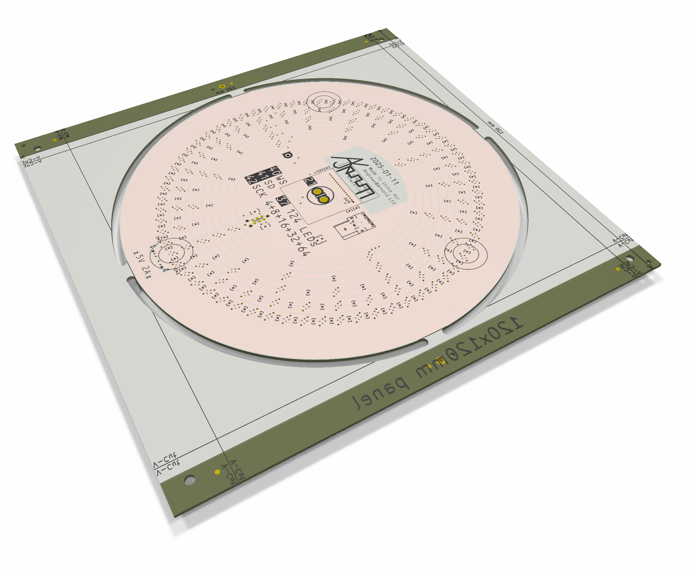
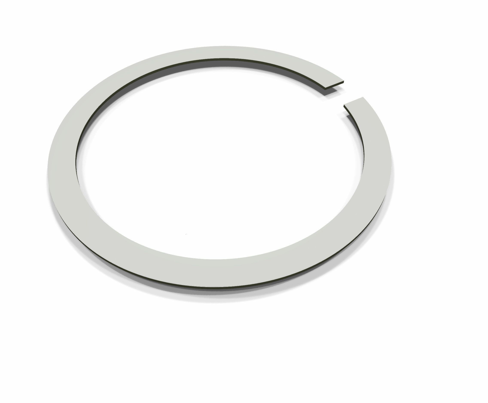
