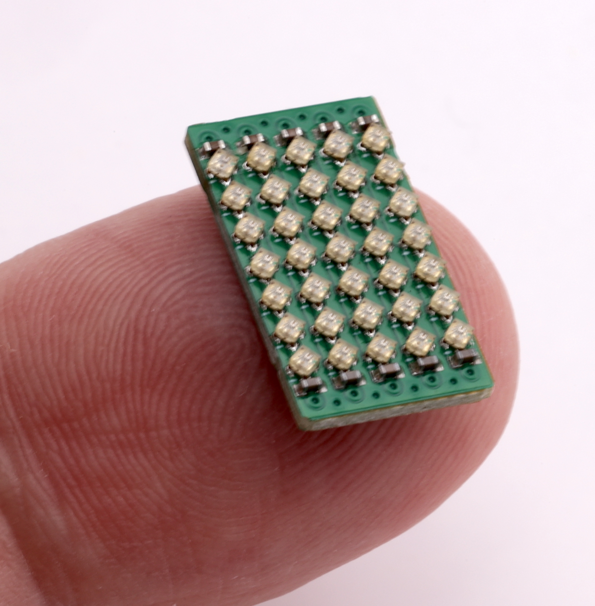

# PCBs

This directory includes `LED` which is an ESP32 based driver modile for WS2812B LED strips.

However, it also includes a number of PCBs with use LEDs, including a `Coaster` design, a `Stargate` and some 5x7 and 5x9 LED grids.

